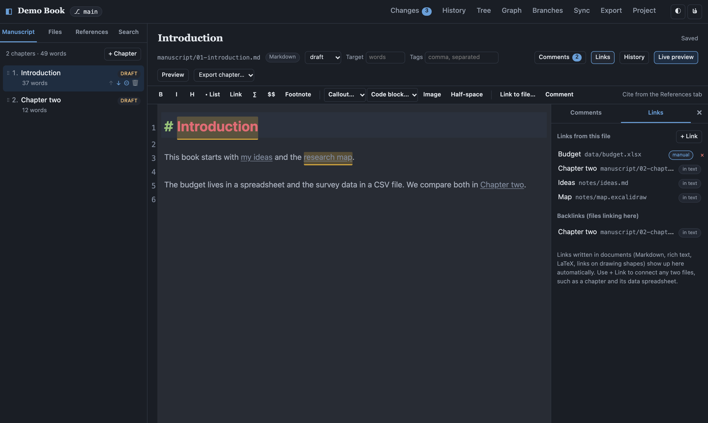
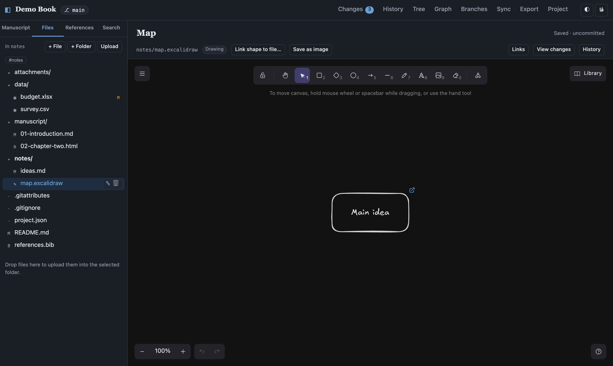
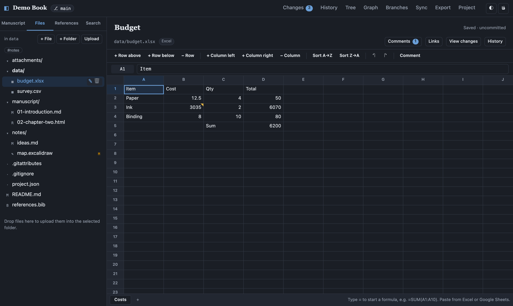
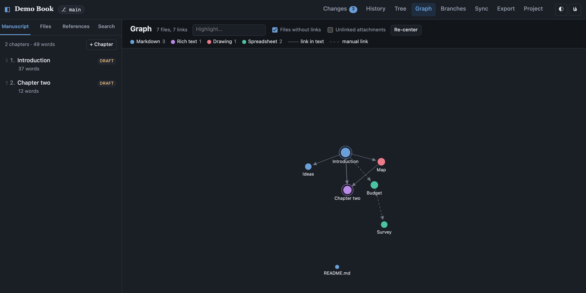
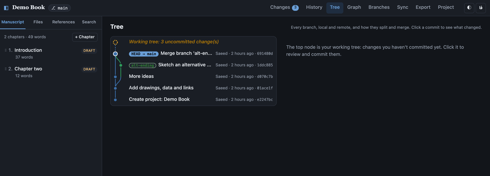

# Document Manager

A local app for writing books and research, with git built in. Every project is a
git repository, so you get a full version history. You can try ideas on branches,
and you can work with a co-author by syncing through GitHub or GitLab.



- **Write** in Markdown, LaTeX, rich text (a Word-like editor) or **Jupyter notebooks**.
  Each chapter can use its own format.
- **Persian and English**, together. The interface is available in English or Persian
  (فارسی, right-to-left, Jalali dates), and documents can mix both languages paragraph by
  paragraph. See [Persian and mixed-direction text](#persian-and-mixed-direction-text).
- **Callouts** (note, tip, warning…) and **syntax-highlighted code blocks** in every format.
- **Run notebooks** in a local Python kernel and see plots, tables and errors inline.
- **Light and dark themes**, either automatic or chosen by you. Exports can be dark too.
- **Structure** a book into chapters. Reorder them, track a status for each (idea → final),
  set word-count targets and follow progress.
- **Research** with notes, tags, full-text search, and attachments (PDFs, images).
- **Draw** mind maps, diagrams and sketches with the built-in [Excalidraw](https://excalidraw.com) editor.
- **Spreadsheets:** open and edit Excel (`.xlsx`) and CSV/TSV files, with live formulas.
- **Link** documents to each other, see backlinks, and explore a **graph** of how everything connects.
- **Comment** on a passage of text or a spreadsheet cell, reply, and resolve threads, together with co-authors.
- **Cite** from a BibTeX bibliography (`references.bib`). Paste entries from Zotero or
  Mendeley, or look them up by DOI. Citations render in the preview and in exports.
- **Export** the whole manuscript to PDF, Word, EPUB, ODT, HTML, LaTeX or Markdown with Pandoc.
- **Version control** without the command line:
  - commit with a message, browse the history, and compare any two versions
  - see every branch as a **tree**, with your uncommitted changes as the top node
  - restore an old version of a file
  - create, switch and merge branches
  - resolve merge conflicts side by side
  - push, pull and fetch to a shared remote

## Install (Windows, macOS, Linux)

You need **Python 3.10 or newer**. On Windows and macOS, get it from
<https://www.python.org/downloads/> (on Windows, tick "Add python.exe to PATH").
Linux usually has it already; add `python3-tk` and `python3-venv` if your distribution
splits them out.

1. Download this repository (the green **Code → Download ZIP** button on GitHub, or `git clone`).
2. Run the installer from the downloaded folder:
   - **Windows:** double-click `installer\install.py`, or run `py installer\install.py`
   - **macOS / Linux:** `python3 installer/install.py`
3. Follow the steps in the window. The installer puts everything in its own folder,
   doesn't need administrator rights, and changes nothing else on your computer:
   - a private Python environment with the app and Jupyter
   - Pandoc, if a version 3.6 or newer isn't installed already
   - portable Git, on Windows only; on macOS and Linux it asks you to install Git if it's missing
   - optionally TinyTeX with the LaTeX packages for PDF export, including Persian typesetting (about 400 MB)
   - optionally numpy, pandas, matplotlib and scipy for notebooks
   - a desktop shortcut and an app-menu entry

   On the options page you can also install into an **existing conda environment or venv**
   instead of a private one, and choose a **PyPI mirror** and a **proxy** for the downloads
   (see below).
4. Start **Document Manager** from the shortcut. It opens in your browser at
   <http://127.0.0.1:8765>, and a small window lets you reopen or stop it.
5. Go to **Settings**: enter your name and email (recorded on every commit), and choose
   the language, theme and calendar.

Your projects are stored in `Documents/Document Manager/projects`, one git repository each.
To remove the app, run the installer again and choose **Uninstall**, or run
`python installer/install.py --uninstall`. Your projects are never deleted.
`--cli` runs the installer in the terminal, which is useful on a machine without a display.

### Installing into Anaconda, Miniconda or an existing venv

The app can live in a conda environment or virtual environment you already manage. Its
packages (Django, Jupyter…) are installed there instead of in a private venv:

```sh
conda create -n docmanager python=3.12 pip     # or use an environment you already have
conda activate docmanager
python installer/install.py --use-current-env  # or: --env /path/to/env from any Python
```

The same works from an activated venv. The graphical installer offers it too and fills
in the environment it was started from. Uninstalling removes the program but leaves that
environment and its packages alone.

Either way, **notebooks can run in any conda environment or venv**, chosen in the app; see
[Python environments and packages](#python-environments-and-packages).

### Mirrors and proxy (for example in Iran or China)

If pypi.org is slow or blocked, pick a mirror in the installer, or pass one on the command line:

```sh
python installer/install.py --pip-index runflare           # a name from the list below, or a URL
python installer/install.py --pip-index https://my.mirror/simple --proxy http://127.0.0.1:8080
```

The proxy is used for every download (Python packages, Pandoc, TinyTeX, Node.js). The app
starts with the same settings, and you can change them later in **Settings → Package
sources and mirrors**.

### Alternative: Docker

If you already use Docker, `docker compose up -d --build` builds an image with
everything included and serves the app at <http://localhost:8000>. Projects are kept
in `./data`. Set `INSTALL_LATEX: "false"` in `docker-compose.yml` for a much smaller
image without PDF export. To build through mirrors, set the `PIP_INDEX_URL` and
`NPM_REGISTRY` build arguments there. Inside the container you can create virtual
environments (stored in `./data/envs`); conda is not included in the image.

## Working with a collaborator

Each person runs their own copy of the app. You share work through a git remote.

1. Create an **empty private repository** on GitHub or GitLab (no README).
2. In the app, go to **Settings → Git hosting credentials** and add a personal access token:
   - **GitHub:** a fine-grained token with *Contents: Read and write* on the repository
     (Settings → Developer settings → Personal access tokens).
   - **GitLab:** a token with the `write_repository` scope.
3. Open your project → **Sync**, paste the repository URL, and press **Push**.
4. Invite your collaborator to the repository. They add their own token, then choose
   **Clone from remote** on the projects page.
5. From then on, **commit** your work, **Pull** to get theirs, and **Push** to share yours.
   If you both changed the same paragraph, the app shows both versions and you pick one or
   edit a merged result.

Tips:
- Use a **branch** for big experiments, such as a restructured chapter or an alternate
  ending. Merge it when you're happy with it.
- Rich-text chapters are saved as HTML with one paragraph per line, so diffs and merges work
  paragraph by paragraph, just as they do for Markdown and LaTeX.
- SSH remotes (`git@github.com:...`) work too. Uncomment the SSH volume in `docker-compose.yml`.
- A shared network folder can act as the remote: use a path like `/data/shared/book.git`
  after creating it with `git init --bare`.

## What a project looks like on disk

```
my-book/
├── project.json        # title, authors, chapter order, statuses, tags, export settings
├── references.bib      # bibliography (BibTeX)
├── manuscript/         # chapters: .md, .tex or .html
├── notes/              # research notes
├── attachments/        # images, PDFs, data
├── .dm/comments/       # comment threads, one JSON file per document (hidden in the app)
└── exports/            # generated files (ignored by git)
```

Drawings (`.excalidraw`), spreadsheets (`.xlsx`, `.csv`) and any other files can live in any folder.

`project.json` is committed like everything else, so chapter order and metadata are shared
with collaborators.

### Citations by format

| Format    | Write                                           |
|-----------|-------------------------------------------------|
| Markdown  | `[@smith2019]`, `[@smith2019, p. 4; @doe2020]`  |
| LaTeX     | `\cite{smith2019}`                              |
| Rich text | Use **Cite** in the References tab              |

To use a different citation style, upload a `.csl` file (see the
[Zotero Style Repository](https://www.zotero.org/styles)) and set its path in **Export**.

## Persian and mixed-direction text

- **Interface:** switch between English and فارسی with the `فا`/`EN` button or in Settings.
  The whole layout mirrors to right-to-left, numbers use Persian digits, and dates use
  the Jalali (Shamsi) calendar. You can change the calendar separately.
- **Documents:** every paragraph takes the direction of its first letter, like `dir="auto"`
  in HTML. A Persian paragraph runs right-to-left and an English paragraph left-to-right,
  even within one chapter. English words inside Persian sentences (and the reverse) are
  placed correctly by the Unicode bidirectional algorithm. This applies in the editors,
  the preview, diffs, notebooks and every export format.
- **Half-space (نیم‌فاصله):** use the toolbar button or <kbd>Ctrl</kbd>+<kbd>Shift</kbd>+<kbd>2</kbd>,
  the same shortcut as Microsoft Word. Words joined with a half-space count as one word.
- **Search** treats Arabic and Persian letter forms as equal (ي/ی, ك/ک), as well as
  Persian, Arabic and Latin digits and half-spaces vs. spaces, so you find text however it was typed.
- **PDF export** uses LuaLaTeX with babel's bidirectional support and the bundled
  [Vazirmatn](https://github.com/rastikerdar/vazirmatn) font (SIL Open Font License) for
  Persian, and Latin Modern for English. Code blocks always stay left-to-right and use the
  monospaced [Vazir Code](https://github.com/rastikerdar/vazir-code-font) font, so Persian
  strings and comments in code are shaped correctly. Set the main
  language under **Project**: Persian puts the page, title and table of contents right-to-left.
  By default the app detects it from the text.
- **Word export** marks Persian paragraphs and runs as right-to-left, so Word lays them out natively.

## Drawings, spreadsheets, links and comments

### Drawings

Create a file ending in `.excalidraw` (**Files → + File → Drawing**) to get an
[Excalidraw](https://excalidraw.com) canvas: mind maps, flowcharts, sketches. It saves
automatically as JSON, so drawings are versioned and diffable like everything else, and work
offline.

- **Link shape to file…** connects the selected shapes to a chapter, note or spreadsheet. Click the
  link icon on a shape to open that file. This turns a mind map into a map of your project.
- **Save as image** writes a PNG into `attachments/`, ready to insert into a chapter with the
  **Image** button and to appear in exports.



### Spreadsheets

`.xlsx` (Excel) and `.csv`/`.tsv` files open in a grid editor:



- Type a value, or `=` to start a formula: arithmetic, `&`, comparisons, ranges, other sheets
  (`Sheet2!A1`), and common functions (`SUM`, `AVERAGE`, `MIN`, `MAX`, `COUNT`, `COUNTA`, `COUNTIF`,
  `SUMIF`, `AVERAGEIF`, `IF`, `IFERROR`, `AND`, `OR`, `ROUND`, `CONCAT`, `LEFT`, `MID`, `LEN`…).
  Results update as you type. For functions the app doesn't know, it shows the value Excel last saved.
- Arrow keys, <kbd>Enter</kbd>, <kbd>Tab</kbd>, <kbd>F2</kbd>, <kbd>Delete</kbd>, undo/redo, and
  shift-click or shift-arrows to select a range. Copy and paste work with Excel, LibreOffice and
  Google Sheets.
- Insert or delete rows and columns, sort by a column, and add, rename (double-click the tab) or
  delete sheets in Excel files.
- Excel files are edited **in place, cell by cell**: formatting, column widths, charts and anything
  else the grid doesn't show are kept. Excel recalculates formula results when it next opens the file.
- CSV files keep their delimiter (`,` `;` or tab). As plain text, they diff and merge line by line.
  Excel files are binary, so a merge conflict means choosing one side.
- Files over 10,000 rows or 200 columns open read-only.

### Links, backlinks and the graph

Links are found in what you write: Markdown links (`[text](../notes/a.md)`) and
`[[wiki links]]` (by file name or title), links in rich text, LaTeX `\input`, `\include`,
`\includegraphics` and `\href`, and links on drawing shapes. Use **Link to file…** in the editor
toolbar to insert one, and <kbd>Ctrl</kbd>/<kbd>⌘</kbd>+click a link to open the file.

The **Links** panel of each file lists where it links to and its **backlinks** (files linking to
it). **+ Link** adds a link between any two files, including spreadsheets, PDFs and images, without
changing their content. These are stored in `project.json` and follow renames.

**Graph** in the top bar shows every file as a dot, colored by type, with arrows for links (dashed
for links added in the Links panel). Click a dot to open the file; hover to highlight its neighbours;
drag and scroll to explore. Chapters of the manuscript have a ring.



### Comments

Select some text in a Markdown, LaTeX, rich-text or plain-text file and press **Comment** (or
<kbd>Ctrl</kbd>+<kbd>Alt</kbd>+<kbd>M</kbd>). In a spreadsheet, select a cell and press **Comment**.
The text gets a yellow highlight, and the thread appears in the **Comments** panel, where you and
co-authors can reply, edit, resolve and reopen. Click a highlight to jump to its thread, and a
thread to jump to its text.

Comments are saved in `.dm/comments/` and committed with your work, so collaborators see them after
they pull. Each thread remembers the quoted text and a little context around it, so it stays
attached while the text is edited; if the passage is deleted, the thread is marked *text changed*.
Comments are not included in exports.

### The commit tree

**Tree** in the top bar draws all branches, local and remote, as lanes that split and merge. The top
node is the **working tree**: your uncommitted changes (click it to review and commit). Click a
commit to see its changes, double-click a branch label to switch to it, or start a new branch from
any commit.



## Callouts and code blocks

| Format    | Callout                                                       | Code block                                    |
|-----------|---------------------------------------------------------------|-----------------------------------------------|
| Markdown  | `> [!warning] Optional title`<br>`> Text…`                    | ```` ```python ```` … ```` ``` ````            |
| LaTeX     | `\begin{callout}{tip}{Optional title} … \end{callout}`        | `\begin{lstlisting}[language=Python] …`       |
| Rich text | **Callout** toolbar button (choose type and title in the box) | **`</>`** button, then pick the language       |

Callout types: `note`, `tip`, `important`, `warning`, `danger`, `example`, `quote`. Common
Obsidian/GitHub names such as `info`, `caution` and `error` are mapped to these. In exports
they become colored boxes in PDF, bordered panels in Word, and styled blocks in HTML/EPUB.
Code is syntax-highlighted in the editors, the preview and exports.

## Jupyter notebooks

Add a chapter or file with the **Jupyter notebook** format, or upload an existing `.ipynb`.

- Code cells run in a local Python kernel. Use <kbd>Shift</kbd>+<kbd>Enter</kbd> to run
  and move to the next cell, and <kbd>Ctrl</kbd>+<kbd>Enter</kbd> to run in place. There
  are also buttons for **Run all**, **Stop**, **Restart** and **Clear outputs**. The kernel
  starts in the notebook's folder, so relative paths to your data work.
- Text cells use Markdown with math (`$x^2$`) and callouts. Double-click a text cell to edit it.
- Outputs are saved in the notebook: text, errors, plots, and tables such as pandas DataFrames.
- **Diffs stay readable:** the Changes and History views show notebooks as cells of code
  and text, with outputs summarised, instead of raw JSON.
- Notebooks can be chapters of a book: exports include their text, code and outputs.
- **Choose the Python environment** in the notebook toolbar: the project's environment
  (the default), any conda environment or venv on the computer, or another installed Jupyter
  kernel (R, Julia…). If the environment lacks `ipykernel`, the app offers to install it.
  **Packages…** opens the package manager. `%pip install` in a cell uses your mirror settings.
- **Interactive output:**
  - **ipywidgets** are live, connected to the kernel: sliders, dropdowns, buttons, `@interact`,
    and `Output` widgets.
  - **Plotly**, **Altair/Vega-Lite**, **Bokeh** and **folium** maps, plus any other HTML output
    that uses JavaScript, run inside a sandboxed frame. That frame can't touch the app or your files.
  - Plotly and Vega ship with the app, so they work offline. Bokeh and folium load their
    libraries from the internet.
  - Widget libraries that need their own browser code (ipympl, bqplot, ipyleaflet) aren't
    supported; their text version is shown instead.
- **Merging notebooks:** when you and a collaborator both edit a notebook, it's merged cell by
  cell instead of as JSON text. Edits to different cells, and cells added on either side, merge
  automatically. If you both changed the *same* cell, the conflict screen shows the two versions
  side by side, with buttons for *Keep mine*, *Keep theirs*, *Keep both* or *Remove the cell*.
- Static HTML and Markdown in outputs are sanitised, so a notebook from a collaborator can't
  run scripts in the app.

## Python environments and packages

Open **Python environments** from the projects page (or **Packages…** in a notebook).

- **Environments found automatically:** the app's own environment, every conda environment
  (Anaconda, Miniconda, Miniforge or Mambaforge on PATH, in its usual folder, or at a path you
  set in Settings), venvs the app created, and `~/.virtualenvs`. Add any other one (such as a
  project's `.venv`) with **Add existing…**.
- **Create** a conda environment with the Python version you want, or a venv based on any
  Python you have. `ipykernel` is always included. conda environments created here are ordinary
  named environments, so `conda activate <name>` works in your terminal too.
- **Packages:** see what's installed (pip and conda packages, with versions), look up the
  versions available, then install, upgrade or remove packages with pip or conda. Every task
  shows its live output and can be cancelled. mamba is used for conda environments when it's
  installed, because it's much faster.
- **Delete** environments the app created, or remove others from the list without touching them.
  The app's own environment and conda's `base` are protected.

### Per project, and with co-authors

In **Project**, choose the project's environment; its notebooks use it unless a notebook picks
its own. The choice is stored on this computer only, because environment paths differ between
people. To share the *contents* of the environment, press **Save environment file**:

- for a conda environment it writes `environment.yml` (the packages you asked for, plus pip
  packages), which works on Windows, macOS and Linux;
- for a venv it writes `requirements.txt` (`pip freeze`).

Commit the file. Your co-author then presses **Create conda environment from
environment.yml** (or **Create venv from requirements.txt**) in the same panel, and the new
environment becomes their project environment.

### Package sources (mirrors)

**Settings → Package sources and mirrors** controls where pip and conda download from. It
applies to everything the app runs: installs, new environments, and `%pip` in notebooks. Your
own `pip.conf` and `.condarc` are never changed.

- **pip:** pip's own settings (the default), a mirror from the list, or any custom index URL,
  plus extra index URLs and trusted hosts.
- **conda:** conda's own settings (`.condarc`), a conda-forge mirror from the list, or your own
  list of channels.
- **Proxy:** an HTTP/HTTPS proxy, and hosts to reach directly.
- **Test** measures the response time of each source, so you can pick the fastest one that
  works from your network.

| Mirror | pip | conda |
| --- | --- | --- |
| Official (pypi.org, conda-forge, prefix.dev) | ✓ | ✓ |
| Runflare (Iran) | ✓ | |
| Liara (Iran) | ✓ | |
| Kargadan (Iran) | ✓ | ✓ conda-forge |
| ITO, Information Technology Organization (Iran) | ✓ | |
| NovinCloud (Iran) | ✓ | |
| Ferdowsi Cloud (Iran) | ✓ | |
| Chabokan (Iran) | ✓ | |
| DevNeeds (Iran) | ✓ | |
| Tsinghua TUNA, Alibaba Cloud, USTC (China) | ✓ | ✓ conda-forge |

These mirrors are run by third parties. They can be slow, out of date or go offline, so use
**Test**, and switch back to the official sources if a mirror misbehaves.

## Themes

The ◐ / ☀ / ☾ button cycles through *system*, *light* and *dark*. The editors, preview and
notebooks follow the theme. In **Export**, *Page theme* can produce a dark PDF, HTML or EPUB
for reading on screen.

## Development

Requirements: Python 3.10+, Node 20+, git, and Pandoc 3.6+ for preview and export. PDF
output needs a TeX distribution with LuaLaTeX (TeX Live, MacTeX or MiKTeX).

```sh
# Backend (http://127.0.0.1:8000)
cd backend
python -m venv .venv
source .venv/bin/activate          # Windows: .venv\Scripts\activate
pip install -r requirements.txt
python manage.py migrate
python manage.py runserver

# Frontend (http://localhost:5173, proxies /api to the backend)
cd frontend
npm install
npm run dev
```

Run the tests:

```sh
cd backend && python manage.py test core
cd frontend && npm run typecheck   # TypeScript + checks every UI string has a Persian translation
```

New UI text goes through `t("English text")` (from `src/i18n.ts`), and its Persian
translation goes in `src/locales/fa.ts`.

### Architecture

- **Backend:** Django and Django REST Framework (`backend/core`). It is a thin layer over
  the git CLI (`services/git.py`), the filesystem (`services/project_files.py`),
  Pandoc (`services/pandoc.py`) and BibTeX (`services/bib.py`). SQLite stores only the
  project registry, your git identity, access tokens, package sources and which
  environment each project or notebook uses. Everything else lives in the repositories.
- **Frontend:** React, TypeScript and Vite. It uses CodeMirror 6 for Markdown, LaTeX and
  notebook cells, TipTap for rich text, Excalidraw for drawings (loaded on demand; its fonts are
  copied to `public/excalidraw/` by `scripts/copy-vendor.mjs` so they work offline) and d3-force
  for the link graph.
- **Spreadsheets:** `services/sheets.py` reads CSV with the `csv` module and Excel with openpyxl,
  and writes only the cells that changed. Formulas are evaluated in the browser
  (`src/sheets/formula.ts`).
- **Links and comments:** `services/links.py` scans files for links and builds the graph;
  `services/comments.py` stores threads per file. Comment anchors are text quotes with context
  (`src/editors/commentMarks.ts`), highlighted with CodeMirror decorations and a ProseMirror plugin.
- **Notebooks:** `services/kernels.py` keeps one Jupyter kernel per open notebook in the
  server process. The app therefore runs as a single process with threads (waitress).
  Live widgets use a small bridge: the browser long-polls `kernel/events/` for kernel
  messages and posts widget messages to `kernel/comm/`. The official
  `@jupyter-widgets/html-manager` renders them (`frontend/src/components/widgets.ts`).
- **Environments and packages:** `services/envs.py` finds conda environments and venvs and runs
  pip/conda. `services/packaging.py` holds the mirror and proxy settings, which reach commands
  as environment variables (`PIP_INDEX_URL`, `HTTPS_PROXY`…) and `--override-channels -c …`.
  Each environment is a kernel named `dm-env-<id>` that runs `python -m ipykernel_launcher` with
  the environment activated, so no kernelspec has to be installed. Long commands run as
  background jobs (`services/jobs.py`), and the browser polls them for live output.
- **Notebook merges:** `services/nbmerge.py` does a three-way merge per cell, matching cells by
  their nbformat id, or by content for older notebooks.
- **Export:** each chapter is converted to a Pandoc AST and the ASTs are concatenated.
  Callouts and code blocks are normalised first (`pandoc/callouts.lua`). The book is then
  rendered in one pass with the bidirectional-text filter (`pandoc/bidi.lua`) and the
  callout renderer, so chapters in different formats and languages share one table of
  contents, one citation style and one bibliography.

## Security notes

The app is designed for **one person on their own computer**:

- It has no login, and it listens only on `127.0.0.1`. Don't expose it to a network.
- Write requests must carry an `X-DM-Client` header. This stops other websites you visit
  from sending commands to the local API (CSRF).
- Access tokens are stored in the local SQLite database (`data/db.sqlite3`). They are sent
  only to the matching host, as a per-command HTTP header, and are never written into
  repository config.
- Previews of documents, which may come from collaborators, render in a sandboxed iframe.
  Notebook Markdown and HTML outputs are sanitised with DOMPurify.
- Notebook code runs only when you press Run, with your user's permissions, just as in
  Jupyter. Read code from others before running it.
- Installing a package runs its install scripts. Install from sources you trust. A mirror can
  serve whatever it likes, so prefer well-known mirrors and keep HTTPS.
